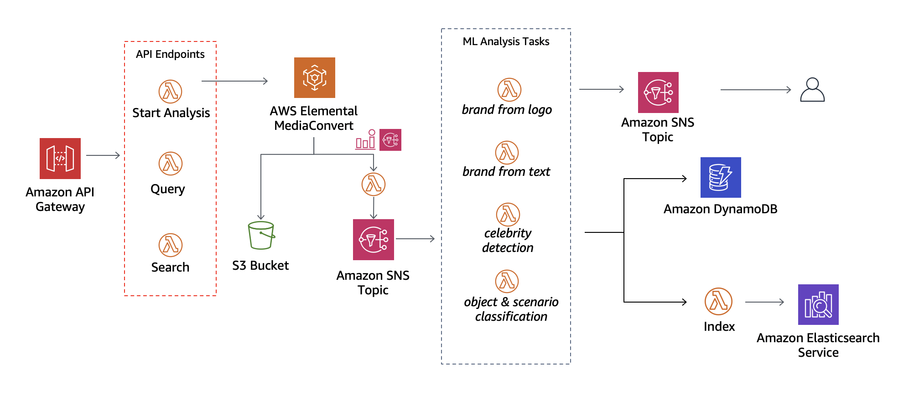

# Media Intelligence Analysis

This repository defines the resources and instructions to deploy a _CloudFormation Stack_ on an AWS Account. 

The stack will deploy the following architecture:



## Description

The application deploys a REST API with the following endpoints:
- `analysis/start`: Starts a video analysis with the specified parameters
- `analysis/search`: Searches for a video that maches a set of filters
- `analysis`: Retrieves the raw analysis results from _DynamoDB_.

The workflow for a video analysis goes as follows:
1. The user uploads a video to a pre-determined S3 Bucket
2. The user calls the __/analysis/start__ endpoint, starting the analysis workflow
3. Multiple analysis are performed. The results are saved onto DynamoDB and ElasticSearch
4. The user searches for a video using one of the provided filters
5. The user retrieves all the information about an specific video using DynamoDB.

## Install

Follow these steps in the order to test this application on your AWS Account:

__Prerequisites__

Please install the following applications on your computer if you haven't already:
- [Docker](https://docs.docker.com/get-docker/)
- [Python 3.7](https://www.python.org/downloads/)
- [AWS SAM CLI](https://docs.aws.amazon.com/serverless-application-model/latest/developerguide/serverless-sam-cli-install.html)


### Creating S3 Bucket(s)

For this prototype we assume that you have two S3 Buckets already created. Troughout this guide we will consider the following:

1. __INPUT_BUCKET__ will hold the video files that will be analysed by the workflow.
2. __OUTPUT_BUCKET__ will receive the files exported by the _MediaConvert_ service.

 Please follow the steps in [this link](https://docs.aws.amazon.com/AmazonS3/latest/userguide/create-bucket-overview.html) and create two S3 bucket if you don't have it already.

### Creating Face Collection on Rekognition

In order to use the Celebrity Recognition Model, you will need to [create a Face Collection on Rekognition](https://docs.aws.amazon.com/rekognition/latest/dg/collections.html) and then index some faces to it.

> Inside the folder `/faces` you will encounter the a list of a few celebrities already split. You can use it as a starter and follow the instructions on [this link](https://docs.aws.amazon.com/rekognition/latest/dg/add-faces-to-collection-procedure.html) to index them to your face collection. Feel free to use the INPUT_BUCKET you've created before to upload the face images.

Please take note of your face collection Id. We will use it in a next step.

### Training a Custom Labels Model on Rekognition

In order for the brand detection algorithm to work, you will need to train a model using _Rekognition Custom Labels_. To do so, please follow the following steps:
1. [Create a Project](https://docs.aws.amazon.com/rekognition/latest/customlabels-dg/cp-create-project.html)
2. Upload the folder `/brands/samples` to the __INPUT_BUCKET__.
3. [Create a dataset](https://docs.aws.amazon.com/rekognition/latest/customlabels-dg/cd-manifest-files.html) using the files you uploaded to S3. Inside the `/brands` you will find a file called `output.manifest`.mainfest`. Open that file and replace <__S3_BUCKET__> with the id of the __INPUT_BUCKET__ you used on the previous step.
4. [Train your model](https://docs.aws.amazon.com/rekognition/latest/customlabels-dg/tm-console.html) (This step might take a few minutes to complete.)
5. [Start your model](https://docs.aws.amazon.com/rekognition/latest/customlabels-dg/rm-run-model.html)
 

After step 5 is complete, take note of your Model Version Arn. We will need it for the next step.

### 5. Configure & Deploy CloudFormation stack

For this step we will need to use a terminal. Please navigate to this folder and run the following commands:

```console
sam build --use-container 
```

```
sam deploy --guided
```

This command will prompt you with a set of parameters, please fill them according to your setup:

| Parameter | Description | Example |
| --------- | ----------- | ------- |
| Email | E-mail to be notified when an analysis completes | my-email@provider.com |
| S3Bucket | The name of the bucket you created previously | INPUT_BUCKET |
| DestinationBucket | The name of the second bucket you created previously | OUTPUT_BUCKET |
| ESDomainName | A unique domain name for the ElasticSearch cluster | my-unique-es-cluster | 
| CognitoDomainName | A unique domain name for the Cognito User Pool | my-unique-cog-cluster |
| DynamoDBTable | A name for the Dynamodb table | aprendiendoaws-ml-mi-jobs |
| CelebrityCollectionID | The Id for the face collection you've created previously | bra-celebs |
| StageName | A name for the stage that will be deployed on API Gateway | Prod |
| OSCDictionary | KEEP DEFAULT | osc_files/dictionary.json |
| ModelVersionArn | The arn of the _Rekognition Custom Labels solution_ you've created previously | arn:aws:rekognition:us-east-1:123456789:project/my-project/verion/my-project |

After filling the values accordingly, use the default configurations until the template starts deploying.

You can visit the _CloudFormation_ tab in the AWS Console to verify the resources created. To do so, click on the __aprendiendoaws-ml-mi__ stack and select the __Resources__ tab.

## Testing

You can use one of the videos provided in the `/ads` folder to perform the testing. To do so, upload the desired video to recently created bucket and call `/start-analysis` to start the workflow. You can use the following snippet as an example:

```json
// #POST /analysis/start
{
  "S3Key": "havaianas.mp4",    // Your video file name
  "SampleRate": 1,              // The desired sample rate
  "analysis": [                 // The desired analysis
    "bst",
    "bfl"
  ]
}
```

If successfull, you will receive a response containing the Media Convert Job Id and status. Now you can use the `/analysis` endpoint to retrieve the current analysis for that particular job:

```json
// POST /analysis
{
  "S3Key": "havaianas.mp4",   // Your video file name
  "JobId": "MyJobId",          // The MediaConvert JobId from the previous step
  "analysis": "bfl"            // [OPTIONAL] Which analysis to retrieve results
}
```


Finally, you can search your analysis results using the `/analysis/search` endpoint:

```json
// POST /analysis/search
{
  "must":  {                 // [OPTIONAL] Choose what aspects you want in the video
    "scenes": [               // [OPTIONAL] Retrieve videos that these scenes
      {
        "scene": "beach",
        "accuracy": 50.0
      }
    ]
  },
  "avoid": {
    "sentiments":[                  // [OPTIONAL] Chose the aspects that  
        {                         // you want to avoid in the video
          "sentiment": "sadness",
          "accuracy": 89.0
        }
    ]
  },
  "S3Key": "havaianas.mp4", // [OPTIONAL] Choose a video search the results
  "SampleRate": 1            // [OPTIONAL] Choose a sample rate to search the results
}
```

## Team

This prototype developed by the AWS Envision Engineering Team. For questions or concerns please reach out to:

- __Tech Lead__: [Pedro Pimentel](mailto:pppimen@amazon.com)
- __EE Engineer__: [Arturo Minor](mailto:arbahena@amazon.com)
